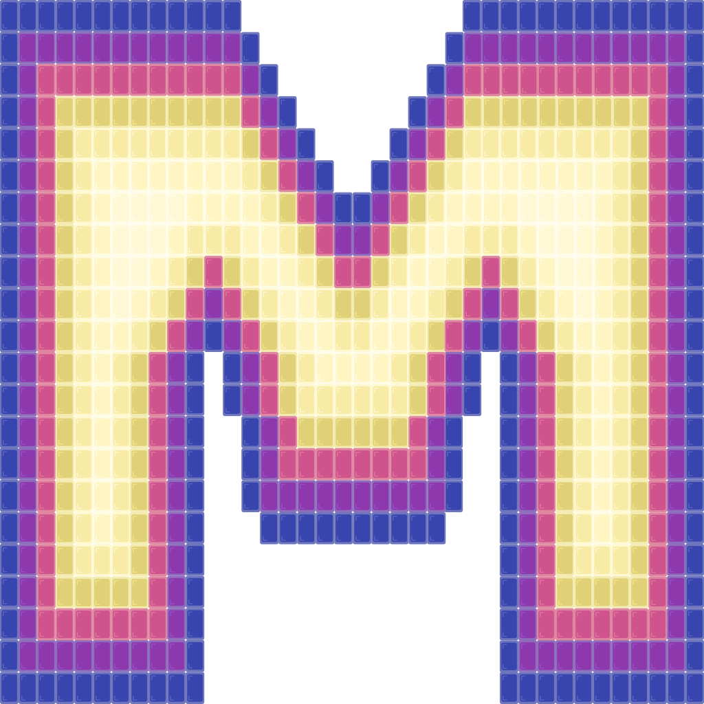

<p align="center"><a href="https://mosaicjs.site" target="_blank" rel="noopener noreferrer"></a></p>
<p align="center">
   <a href="https://www.npmjs.com/package/@authman2/mosaic"></a>
   <a href="https://npmcharts.com/compare/@authman2/mosaic?minimal=true"></a>
   
</p>

# <a target='_blank' rel='noopener noreferrer' href='https://mosaicjs.site'>Mosaic</a>
Mosaic is a declarative front-end JavaScript library for building user interfaces!

💠 **(Web) Component-Based**: Mosaic uses the Custom Elements API to create web components that can keep track of their own data, actions, and more, and can be included in other components to create single page applications.

⚡️ **Observable Data**: Mosaic uses Observables to keep track of changes to a component's data. This means 
that there is no need to call "setState" or anything like that to update a component - instead just change the data directly.

🧠 **Smart DOM**: Updates in Mosaic work by remembering which nodes are dynamic (i.e. subject to change) and traveling directly to those nodes to make changes, rather than traversing the tree again.

🔀 **Built-in Router**: Comes with a basic, client-side router which allows Mosaic components to be used as separate pages.

🌐 **State Manager**: Comes with a built-in global state manager called *Portfolio*.

👌 **Small Library Size**: The minified Mosaic library comes in at a size of 20.2KB.

🔖 **Tagged Template Literals**: Views are written using tagged template literals, which means there is no need for a compiler:
```javascript
const name = "Mosaic";
html`<h1>Welcome to ${name}!</h1>`
```

## Demo
Here is an example of a simple Mosaic application. All you need is an index.html file and an index.js file.
For a more detailed example, run the project inside the "example" folder.

**index.html**:
```html
<html>
  <head>
    <title>My Mosaic App</title>
  </head>
    
  <div id='root'></div>

  <script src='https://unpkg.com/@authman2/mosaic@latest/dist/index.js'></script>
  <script type="text/javascript" src='./index.js'></script>
</html>
```
**index.js**:
```js
// Import Mosaic
import Mosaic from '@authman2/mosaic';

// The "text" data property gets injected by 
// the parent component.
new Mosaic({
    name: 'my-label',
    view: self => {
        return html`
            <h2>${ self.data.text }</h2>
            <p>This is a custom label component!</p>
        `;
    }
});

// Create an app component. Note how components
// do not need to be nested under a single div.
const app = new Mosaic({
    element: 'root',
    name: 'my-app',
    data: { title: "Mosaic App" },
    sayHello: function() {
        console.log("Hello World!!");
        console.log("This component is ", this);
    },
    view: function() {
        return html`
            <h1>This is a ${this.data.title}!</h1>
            <p>Click below to print a message!</p>
            <button onclick="${this.sayHello}">Click Me!</button>

            <my-label text='Welcome to Mosaic!'></my-label>
        `;
    }
});

// Paint the Mosaic onto the page.
app.paint();
```

## Installation
The easiest way to use Mosaic is to first install the npm package by using:
```shell
npm install --save @authman2/mosaic
```
or with a script tag.
```html
<script src='https://unpkg.com/@authman2/mosaic@latest/dist/index.js'></script>
```
**(Optional)** For fast builds and hot reloading, install the build tool "Parcel." This is not required, though, as Mosaic uses built-in JavaScript features. This means that no build tool is required, but any may be used if it helps the overall project structure.
```shell
npm install --save-dev parcel-bundler
```
Now you are ready to use Mosaic!

# Author
- Year: 2019
- Programmer: Adeola Uthman
- Languages/Tools: JavaScript, TypeScript, Parcel